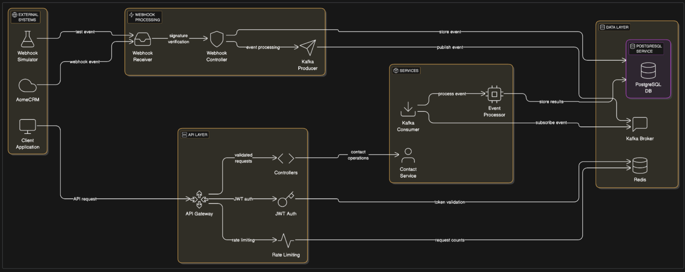

# AcmeCRM Integration API


## Architecture Diagram



## Application Flow

When a change occurs in AcmeCRM (such as a contact being created, updated, or deleted), the following flow is triggered:

1. **AcmeCRM Webhook Trigger**: AcmeCRM detects the change and sends a webhook event to our integration's webhook endpoint with the contact data and a signature.

2. **Webhook Receiver**: The webhook receiver validates the signature using HMAC-SHA256 to ensure the request is legitimate and not tampered with. This prevents unauthorized access and replay attacks.

3. **Event Storage**: The validated webhook event is stored in PostgreSQL for audit purposes and to ensure no events are lost, even in case of system failures.

4. **Kafka Producer**: The webhook controller publishes the event to a Kafka topic, allowing for asynchronous processing. This decouples the webhook reception from the actual processing, improving system resilience.

5. **Kafka Consumer**: A dedicated Kafka consumer subscribes to the contact events topic and processes events as they arrive.

6. **Event Processing**: The consumer processes each event based on its type:
   - For contact creation: Maps the AcmeCRM format to our internal format and stores in PostgreSQL
   - For contact updates: Updates the existing contact with new information
   - For contact deletion: Performs a soft delete by changing the contact status

7. **Transaction Support**: All database operations are performed within transactions to ensure data consistency, especially when updating multiple tables.

8. **Event Tracking**: The system tracks metrics for all processed events, including success/failure counts and processing times, enabling monitoring and troubleshooting.

Meanwhile, the API layer provides CRUD operations for contacts with:

- JWT authentication to secure API endpoints
- Redis-based token storage for quick validation and revocation
- Rate limiting to prevent abuse
- PostgreSQL for persistent storage of contacts and events

## Key Decisions, Tradeoffs, and Assumptions

1. **Asynchronous Processing with Kafka**
   - **Decision**: Use Kafka for asynchronous event processing
   - **Reasoning**: Decouples webhook reception from processing, allowing the system to handle high volumes of events without blocking
   - **Tradeoff**: Adds complexity and infrastructure requirements, but provides better scalability and resilience

2. **PostgreSQL for Data Storage**
   - **Decision**: Migrate from Redis to PostgreSQL for contact storage
   - **Reasoning**: Better support for complex queries, transactions, and data integrity
   - **Tradeoff**: Slightly higher latency compared to Redis, but better data consistency and relationship modeling

3. **JWT Authentication with Redis**
   - **Decision**: Use JWTs for authentication with Redis for token storage
   - **Reasoning**: JWTs provide stateless authentication, while Redis enables quick validation and revocation
   - **Tradeoff**: Requires maintaining a Redis instance, but provides better security through token revocation

4. **Webhook Signature Verification**
   - **Decision**: Implement HMAC-SHA256 signature verification with timestamp validation
   - **Reasoning**: Ensures webhooks are legitimate and prevents replay attacks
   - **Assumption**: AcmeCRM provides a shared secret for signature generation

5. **Soft Deletion for Contacts**
   - **Decision**: Implement soft deletion by changing status instead of removing records
   - **Reasoning**: Preserves data history and enables potential recovery
   - **Tradeoff**: Requires filtering in queries, but maintains data integrity

6. **Transaction Support**
   - **Decision**: Use database transactions for multi-step operations
   - **Reasoning**: Ensures data consistency, especially when updating multiple tables
   - **Tradeoff**: Slightly higher complexity, but prevents partial updates

## Most Difficult Issues Faced

The most challenging aspect of building this integration system was ensuring reliable event processing with proper error handling and recovery mechanisms. Specifically:

1. **Kafka Consumer Resilience**: Implementing the Kafka consumer to handle various error scenarios (network issues, message parsing errors, database failures) while maintaining processing guarantees was complex.

2. **Optimistic Concurrency Control**: Implementing version-based concurrency control to handle simultaneous updates to the same contact from different sources required careful design.

3. **Webhook Signature Verification**: Ensuring the security of webhook processing while maintaining compatibility with AcmeCRM's signing mechanism required precise implementation.

4. **Database Migration**: Transitioning from Redis to PostgreSQL while maintaining backward compatibility and ensuring data integrity during the migration process was challenging.

## Future Improvements

With more time, the following improvements could be made:

1. **Dead Letter Queue**: Implement a dead letter queue for failed message processing, allowing for retry and manual intervention.

2. **Horizontal Scaling**: Enhance the Kafka consumer group configuration to support multiple consumer instances for higher throughput.

3. **Schema Validation**: Add JSON schema validation for webhook payloads to catch format changes early.

4. **Caching Layer**: Implement a caching strategy for frequently accessed contacts to reduce database load.

---


> **Note**: For detailed information about APIs, database tables, Kafka topics, unit tests, and integration tests, please visit the documentation files in the docs folder. This document explains the high-level flow of the application, along with the decisions made along the way.
>
> **Documentation Files**:
> - [**Tasks.md**](https://github.com/Siddartha-Kodaboina/acme-crm-integration/blob/main/docs/Tasks.md): Tracks the progress of tasks in the application and their completion status
> - [**Setup.md**](https://github.com/Siddartha-Kodaboina/acme-crm-integration/blob/main/docs/Setup.md): Contains installation, configuration, and deployment instructions
> - [**API-Documentation.md**](https://github.com/Siddartha-Kodaboina/acme-crm-integration/blob/main/docs/API-Documentation.md): Details all API endpoints, request/response formats, and examples
> - [**Database-Schema.md**](https://github.com/Siddartha-Kodaboina/acme-crm-integration/blob/main/docs/Database-Schema.md): Describes the PostgreSQL database schema and relationships
> - [**Kafka-Topics.md**](https://github.com/Siddartha-Kodaboina/acme-crm-integration/blob/main/docs/Kafka-Topics.md): Explains Kafka topics, message formats, and consumer/producer configuration
> - [**Authentication.md**](https://github.com/Siddartha-Kodaboina/acme-crm-integration/blob/main/docs/Authentication.md): Details the JWT authentication implementation and security considerations
> - [**Webhook-Integration.md**](https://github.com/Siddartha-Kodaboina/acme-crm-integration/blob/main/docs/Webhook-Integration.md): Provides information about webhook processing and integration with AcmeCRM
> - [**Error-Handling.md**](https://github.com/Siddartha-Kodaboina/acme-crm-integration/blob/main/docs/Error-Handling.md): Describes the error handling approach and error codes

## Features

- **Contact Management**: Complete CRUD operations for contacts
- **Authentication**: JWT-based authentication for API security
- **Webhook Processing**: Receive and process webhook events from AcmeCRM
- **Asynchronous Processing**: Kafka-based event processing with transaction support
- **Data Persistence**: PostgreSQL for contact and event storage
- **Rate Limiting**: Redis-based rate limiting for API protection
- **Event Tracking**: Metrics and tracking for processed events
- **Webhook Simulation**: Tools for simulating webhook events

## Architecture

The system follows an MVC architecture with a repository pattern for database operations:

- **Models**: Business logic and data access
- **Controllers**: Request handling and response formatting
- **Services**: External integrations and utilities
- **Middleware**: Authentication, validation, and error handling
- **Routes**: API endpoint definitions

## API Endpoints

### Authentication

- `POST /api/auth/login`: Authenticate and receive JWT token
- `POST /api/auth/logout`: Invalidate JWT token

### Contacts

- `GET /api/contacts`: List all contacts
- `GET /api/contacts/:id`: Get a specific contact
- `POST /api/contacts`: Create a new contact
- `PUT /api/contacts/:id`: Update a contact (full update)
- `PATCH /api/contacts/:id`: Update a contact (partial update)
- `DELETE /api/contacts/:id`: Delete a contact

### Webhooks

- `POST /api/webhooks`: Receive webhook events from AcmeCRM

### Webhook Simulator

- `POST /api/simulator/webhooks`: Manually trigger a simulated webhook event
- `GET /api/simulator/webhooks/history`: View history of simulated webhook events
- `GET /api/simulator/webhooks/history/:id`: Get details of a specific simulated webhook

## Webhook Implementation

### Security

Webhooks are secured using HMAC-SHA256 signature verification. Each webhook request includes:

- `X-Acme-Signature`: HMAC-SHA256 signature of the request body
- `X-Acme-Timestamp`: Timestamp of when the webhook was sent

### Event Types

The system processes the following webhook event types:

- `contact.created`: A new contact was created in AcmeCRM
- `contact.updated`: A contact was updated in AcmeCRM
- `contact.deleted`: A contact was deleted in AcmeCRM

### Processing Flow

1. Webhook request is received
2. Signature is verified
3. Payload is validated
4. Event is acknowledged immediately
5. Event is published to Kafka for asynchronous processing
6. Event is processed and stored in PostgreSQL

## Webhook Simulator

The webhook simulator allows you to test webhook functionality without relying on the actual AcmeCRM system.

### Features

- Generate simulated webhook events for different event types
- Automatically trigger webhooks after CRUD operations
- Sign webhooks using the same HMAC-SHA256 algorithm as AcmeCRM
- Deliver webhooks to configured endpoints with retry capability
- Track webhook delivery history and status

### Usage

#### Manual Triggering

```
POST /api/simulator/webhooks

{
  "eventType": "contact.created",
  "data": {
    "id": "c8b5f7d9-8e7a-4a1d-9b5c-1d2e3f4a5b6c",
    "firstName": "John",
    "lastName": "Doe",
    "email": "john.doe@example.com"
  },
  "targetUrl": "http://localhost:3000/api/webhooks"
}
```

#### Automatic Triggering

Webhooks are automatically triggered after the following operations:

- Creating a contact: Triggers `contact.created`
- Updating a contact: Triggers `contact.updated`
- Deleting a contact: Triggers `contact.deleted`

## Setup and Configuration

### Prerequisites

- Node.js (v14+)
- PostgreSQL
- Redis
- Kafka

### Environment Variables

```
# Server
PORT=3000
NODE_ENV=development

# Database
DB_TYPE=postgres
POSTGRES_HOST=localhost
POSTGRES_PORT=5432
POSTGRES_USER=postgres
POSTGRES_PASSWORD=postgres
POSTGRES_DB=acmecrm

# Redis
REDIS_HOST=localhost
REDIS_PORT=6379
REDIS_PASSWORD=

# Authentication
JWT_SECRET=your-secret-key
JWT_EXPIRATION=1h

# AcmeCRM
ACME_API_KEY=your-api-key
ACME_WEBHOOK_SECRET=your-webhook-secret

# Kafka
KAFKA_BROKERS=localhost:9092
KAFKA_CLIENT_ID=acmecrm-integration

## Kafka Consumer Implementation

The system includes Kafka consumers for processing events asynchronously:

### Contact Event Consumer

Processes contact-related events from Kafka topics and stores them in PostgreSQL:

- **Event Types**: `contact.created`, `contact.updated`, `contact.deleted`
- **Processing**: Maps AcmeCRM fields to internal format
- **Storage**: Uses PostgreSQL transactions for data consistency
- **Metrics**: Tracks event processing statistics
- **Error Handling**: Comprehensive error handling with detailed logging

### Running the Consumer

```bash
# Start the Kafka consumer
node src/consumers/index.js
```

### Testing the Consumer

```bash
# Run the end-to-end test
node src/tests/kafka-consumer.test.js
```

## Installation

```bash
# Clone the repository
git clone https://github.com/your-organization/acme-crm-integration.git
cd acme-crm-integration

# Install dependencies
npm install

# Set up environment variables
cp .env.example .env
# Edit .env with your configuration

# Start the service
npm start
```

## Running the Application

```bash
# Install dependencies
npm install

# Run in development mode
npm run dev

# Run in production mode
npm start

# Run tests
npm test
```

## Error Handling

The API uses standard HTTP status codes and returns error responses in the following format:

```json
{
  "error": {
    "message": "Error message",
    "type": "ERROR_TYPE",
    "status": 400,
    "timestamp": "2025-05-19T00:00:00.000Z",
    "code": "ERROR_CODE",
    "details": {}
  }
}
```
